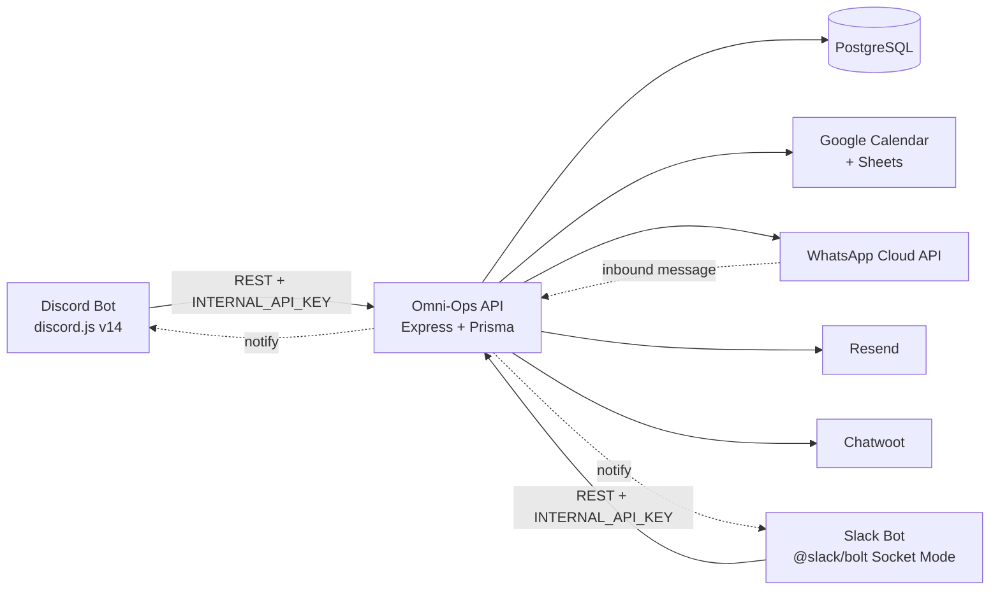

# Omni-Ops

**Multi-tenant business operations platform that lives inside Discord and Slack.**

Omni-Ops turns a chat workspace into an operations console. Each Discord server or Slack team gets its own isolated data, its own Google Calendar and Sheets, its own WhatsApp campaigns, and its own AI assistant — all served from a single deployment.


---

## Contents

- [Why Omni-Ops](#why-omni-ops)
- [Features](#features)
- [Architecture](#architecture)
- [Repository layout](#repository-layout)
- [Quick start](#quick-start)
- [Environment variables](#environment-variables)
- [Integrations](#integrations)
- [Command reference](#command-reference)
- [Security](#security)
- [Troubleshooting](#troubleshooting)
- [Contributing](#contributing)
- [License](#license)

---

## Why Omni-Ops

Small teams already live in Discord or Slack. Omni-Ops means they don't have to leave: tasks, appointments, leads, invoices and reporting all happen in the channel, in the same thread as the conversation that created them.

It's built for the operator who wants one deployment to serve many clients or many teams. Every record is scoped to a workspace, and every workspace brings its own Google account, its own AI provider key, and its own settings.

**Good fit if you:**

- Run an agency, service business or internal ops team out of a chat workspace
- Need Google Calendar and Sheets as the source of truth your non-technical staff can see
- Want lead capture from WhatsApp landing in a channel within seconds
- Would rather self-host than pay per seat

**Not a fit if you** need a full accounting suite, a public-facing customer portal, or a hosted SaaS you don't have to operate yourself.

---

## Features

### Operations

| Area             | What you get                                                                       |
| ---------------- | ---------------------------------------------------------------------------------- |
| **Tasks**        | Create, assign, edit and track tasks with status transitions and per-user views     |
| **Appointments** | Single or recurring appointments, conflict checking, two-way Google Calendar sync   |
| **Calendar**     | Organization-wide events with employee assignment                                   |
| **Invoicing**    | Build invoices, email them via Resend, track payment status, signed PDF links       |
| **Employees**    | Link chat accounts to employee records, assign roles, enforce permissions           |
| **Dashboard**    | Management statistics across tasks, appointments and revenue                        |
| **Personal**     | `/omni-my` — your profile, your tasks, your schedule, your performance, reminders    |

### CRM and marketing

| Area          | What you get                                                                        |
| ------------- | ----------------------------------------------------------------------------------- |
| **Leads**     | Add singly or in bulk, assign to staff, set status, attach notes, sync to Sheets     |
| **Campaigns** | WhatsApp bulk sends with audience filtering, opt-out handling, live send status      |

### AI assistant

@mention the bot in any channel, or DM it, and ask in plain language.

- **Retrieval tools run immediately** — listing tasks or pulling stats needs no approval.
- **Mutating tools require confirmation** — creating a task or changing a status posts a ✅ / ❌ prompt first.
- **Bring your own key**, per workspace: Anthropic Claude, OpenAI GPT, Google Gemini, DeepSeek or Qwen.

```
@Omni-Ops what's overdue for the design team this week?
@Omni-Ops create a task for Sara to call the Al Sadd lead tomorrow at 10
```

---

## Architecture

Three independent services share one PostgreSQL database. The API owns all logic and data; the bots are thin platform adapters. Run Discord only, Slack only, or both.



**Why it's split this way:** platform SDKs are noisy and change often. Keeping every business rule in the API means adding a third platform later is an adapter, not a rewrite — and it means a Discord outage can't take your data layer with it.

The dotted arrows are the notify path: an inbound WhatsApp message creates a lead in the API, which then pushes a card into the configured leads channel on each running bot.

---

## Repository layout

```
Omni-Ops/
├── Omni-Ops-api/          # Core service — all logic, data and integrations
│   ├── prisma/            # Schema and migrations
│   └── src/
│       ├── modules/       # tasks, crm, campaigns, invoices, calendar,
│       │                  # employees, roles, dashboard, reminders,
│       │                  # workspaces, sheets, google, links
│       ├── integrations/  # Google, WhatsApp, Chatwoot, bot notifier
│       ├── middleware/    # auth, WhatsApp webhook verification
│       ├── jobs/          # scheduled maintenance
│       └── utils/         # crypto, phone, timezone, tenant resolution
├── Omni-Ops-bot/          # Discord adapter
│   └── src/
│       ├── commands/      # one file per slash command
│       ├── events/        # interactions, messages, reactions, guild lifecycle
│       ├── cron/          # scheduled reports and reminders
│       └── utils/         # AI gateway + tools, date parsing, caching
└── Omni-Ops-slack/        # Slack adapter
    ├── slack-app-manifest.json
    └── src/
```

---

## Quick start

### Prerequisites

- Node.js 20 or later
- PostgreSQL 15 or later
- Railway (recommended), or any Docker host
- A Discord server or Slack workspace where you have admin rights

### 1. Deploy the API

The API holds the database and all logic. Both bots must be able to reach it.

```bash
git clone https://github.com/Filx2001/Omni-Ops.git
cd Omni-Ops/Omni-Ops-api
npm install
cp .env.example .env
```

Generate the two secrets:

```bash
openssl rand -hex 32   # INTERNAL_API_KEY
openssl rand -hex 32   # SECRET_ENCRYPTION_KEY
```

Fill in `.env`, then run migrations and start:

```bash
npx prisma migrate deploy
npm start
```

> **Keep `SECRET_ENCRYPTION_KEY` safe and unchanged.** It encrypts every stored AI key, Slack token and Google refresh token. Rotating it without re-encrypting will lock you out of all workspace credentials.

### 2. Deploy the Discord bot (optional)

```bash
cd ../Omni-Ops-bot
npm install
npm start
```

Set `DISCORD_BOT_TOKEN`, `DISCORD_CLIENT_ID`, `DISCORD_GUILD_ID`, `API_URL` and `INTERNAL_API_KEY`. Slash commands register to your guild automatically on startup.

### 3. Deploy the Slack bot (optional)

```bash
cd ../Omni-Ops-slack
npm install
npm start
```

Create the Slack app from [`Omni-Ops-slack/slack-app-manifest.json`](Omni-Ops-slack/slack-app-manifest.json) — it sets up all slash commands, scopes and event subscriptions in one step. Full walkthrough: **[SLACK_SETUP.md](SLACK_SETUP.md)**.

### 4. Connect Google (optional)

1. In Google Cloud Console, create an OAuth 2.0 Client (Web application) with redirect URI `https://<your-api-url>/google/callback`.
2. Set `GOOGLE_OAUTH_CLIENT_ID` and `GOOGLE_OAUTH_CLIENT_SECRET` on the API service.
3. Run `/omni-config` (Slack) or `/config setup` (Discord) and click **Connect Google**.

First connect auto-provisions a Calendar plus four Sheets: Leads, Schedule, Accounting and Personal.

### 5. First run

```
/omni-employee register    # Slack — workspace owner becomes Admin
/setup                     # Discord — same thing
/omni-ping                 # confirm the bot reaches the API
/omni-task create          # your first task
```

---

## Environment variables

### API (`Omni-Ops-api`)

| Variable                     | Required | Description                                                 |
| ---------------------------- | -------- | ----------------------------------------------------------- |
| `DATABASE_URL`               | Yes      | PostgreSQL connection string                                |
| `INTERNAL_API_KEY`           | Yes      | Shared secret for bot-to-API calls; must match on both bots  |
| `SECRET_ENCRYPTION_KEY`      | Yes      | 64 hex chars. Encrypts stored workspace credentials at rest  |
| `API_PUBLIC_URL`             | Yes      | Public HTTPS URL — used for OAuth callbacks and PDF links    |
| `PDF_LINK_SECRET`            | Yes      | Signs invoice PDF links; must match the bots                 |
| `GOOGLE_OAUTH_CLIENT_ID`     | No       | Required only for Google Calendar / Sheets                   |
| `GOOGLE_OAUTH_CLIENT_SECRET` | No       | Required only for Google Calendar / Sheets                   |
| `DISCORD_BOT_NOTIFY_URL`     | No       | Internal URL of the Discord bot's notify server              |
| `SLACK_BOT_NOTIFY_URL`       | No       | Internal URL of the Slack bot's notify server                |

WhatsApp Cloud API, Resend and Chatwoot credentials are also read by the API — see `Omni-Ops-api/.env.example` for the exact names.

### Discord bot (`Omni-Ops-bot`)

| Variable             | Required | Description                                       |
| -------------------- | -------- | ------------------------------------------------- |
| `DISCORD_BOT_TOKEN`  | Yes      | Bot token from the Discord developer portal       |
| `DISCORD_CLIENT_ID`  | Yes      | Application ID                                    |
| `DISCORD_GUILD_ID`   | Yes      | Guild to register slash commands against          |
| `API_URL`            | Yes      | Internal URL of the API service                   |
| `INTERNAL_API_KEY`   | Yes      | Must match the API                                |
| `PDF_LINK_SECRET`    | Yes      | Must match the API                                |
| `NOTIFY_PORT`        | No       | Port for the internal notify server               |
| `DEFAULT_TIMEZONE`   | No       | Fallback when a workspace has no timezone set     |

### Slack bot (`Omni-Ops-slack`)

| Variable                | Required | Description                                    |
| ----------------------- | -------- | ---------------------------------------------- |
| `SLACK_APP_TOKEN`       | Yes      | App-level token (`xapp-`), scope `connections:write` |
| `SLACK_BOT_TOKEN`       | Yes      | Bot user OAuth token (`xoxb-`)                 |
| `SLACK_SIGNING_SECRET`  | Yes      | From Basic Information                         |
| `API_URL`               | Yes      | Internal URL of the API service                |
| `API_PUBLIC_URL`        | Yes      | Public API URL, for links posted into Slack    |
| `INTERNAL_API_KEY`      | Yes      | Must match the API                             |
| `PDF_LINK_SECRET`       | Yes      | Must match the API                             |
| `NOTIFY_PORT`           | No       | Port for the internal notify server            |
| `DEFAULT_TIMEZONE`      | No       | Fallback when a workspace has no timezone set  |

---

## Integrations

| Service               | What it does                                                                      | Setup                                              |
| --------------------- | --------------------------------------------------------------------------------- | -------------------------------------------------- |
| **Google Workspace**  | Per-workspace OAuth; auto-provisions a Calendar and four Sheets                    | `GOOGLE_OAUTH_*` on the API, then `/omni-config`    |
| **WhatsApp Cloud API**| Inbound messages become leads and post to your leads channel; powers bulk campaigns| Webhook pointed at the API, credentials in `.env`   |
| **Resend**            | Emails invoices to customers                                                       | API key in `.env`                                   |
| **Chatwoot**          | Inbox bridge so agents can reply from Chatwoot                                     | Credentials in `.env`                               |
| **AI providers**      | Claude, GPT, Gemini, DeepSeek, Qwen                                                | `/omni-config` → 🤖 AI → choose provider, paste key |

---

## Command reference

Slack uses flat commands (`/omni-task`); Discord uses the same names with subcommands.

| Command                                                             | Description                             |
| ------------------------------------------------------------------- | --------------------------------------- |
| `/omni-ping`                                                        | Test connectivity to the API            |
| `/omni-config`                                                      | Workspace control panel                 |
| `/omni-employee register`                                           | Register yourself (owner becomes Admin) |
| `/omni-employee link <email>`                                       | Link your chat account to an employee   |
| `/omni-employee create · edit · list`                               | Manage employee records (Manager+)      |
| `/omni-employee set-admin <user>`                                   | Promote to Admin (Admin only)           |
| `/omni-task create · list · edit · status · delete`                 | Task management                         |
| `/omni-appointment add · list · edit · delete`                      | Appointment scheduling                  |
| `/omni-calendar create · list · edit · delete · sync`               | Organization events                     |
| `/omni-invoice create · list · status · delete`                     | Invoicing and payments                  |
| `/omni-dashboard`                                                   | Management statistics                   |
| `/omni-my profile · tasks · appointments · performance · reminders` | Personal workspace                      |
| `/omni-leads list · add · multi-add · info · assign · status · note · edit · delete` | CRM management   |
| `/omni-campaign audience · new · list · send · stop · status · info · recipients`   | WhatsApp campaigns |
| `@Omni-Ops <question>`                                              | AI assistant in a channel               |
| DM the bot                                                          | AI assistant in private                 |

---

## Security

- **Tenant isolation** — every Prisma query is scoped to a workspace; there is no cross-workspace read path.
- **Secrets encrypted at rest** — `aiApiKey`, `slackBotToken` and `googleRefreshToken` are encrypted with a key that never leaves your environment.
- **Signed PDF links** — invoice PDFs are served behind HMAC-SHA256 signatures that expire after one hour.
- **OAuth CSRF protection** — the Google OAuth `state` parameter is HMAC-signed and verified on callback.
- **Bot-to-API auth** — every internal call carries `INTERNAL_API_KEY`; keep the API on a private network where your host supports it.
- **AI guardrails** — the assistant cannot mutate data without an explicit reaction confirmation from the user.

Never commit a `.env` file. Each service ships a `.gitignore` that excludes it; if you suspect a key was ever committed, rotate it and rewrite history rather than just deleting the file.

Found a vulnerability? Open a private security advisory on this repository rather than a public issue.

---

## Troubleshooting

| Symptom                              | Likely cause and fix                                                                                     |
| ------------------------------------ | -------------------------------------------------------------------------------------------------------- |
| Slash commands missing               | Slack: re-install from the manifest, then reload the client. Discord: check `DISCORD_GUILD_ID` and restart |
| `You are not registered`             | Run `/omni-employee register` (Slack) or `/setup` (Discord)                                               |
| `API error: 404` / can't reach API   | `API_URL` is wrong or the API is down; confirm `INTERNAL_API_KEY` matches on both sides                    |
| WhatsApp leads not posting           | Set `SLACK_BOT_NOTIFY_URL` / `DISCORD_BOT_NOTIFY_URL` on the API, and pick a leads channel in `/omni-config` |
| AI replies "not configured"          | `/omni-config` → 🤖 AI → select a provider and paste a key                                                |
| Google sync silently doing nothing   | Re-run **Connect Google**; the refresh token may have been revoked                                        |

Slack-specific problems are covered in more depth in [SLACK_SETUP.md](SLACK_SETUP.md).

---

## Contributing

Issues and pull requests are welcome.

```bash
npm install          # in the service you're changing
npx prisma validate  # API only, before touching the schema
```

Formatting is handled by Prettier via the root `.prettierrc` — run it before committing. Keep business logic in the API and platform-specific code in the adapters; if you find yourself writing a Prisma query inside a bot, it belongs in a module instead.

---

## License

MIT — see [LICENSE](LICENSE).
